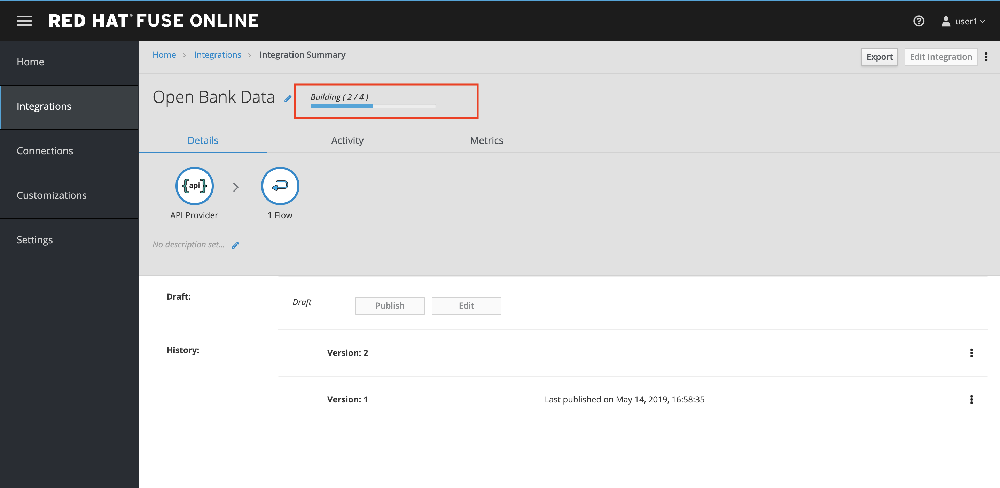

:user-password: openshift

= Lab 01 - Financial Backend Services

This first session will take us to the creation of a simple REST service from a database source.

*Overview*

This is quite a common scenario and one that goes well for quick prototyping service scenarios.

*Credentials:*

Your username is: `{user-username}` +
Your password is: `{user-password}`

[type=walkthroughResource,serviceName=fuse]
.Fuse Online
****
* link:{fuse-url}[Console, window="_blank"]
****

[time=15]
[id='database-connection']
== Database connection

Let’s start by creating the connection to an existing DB part of our existing infrastructure. It is a data store built on PostgreSQL and (for this lab) hosted on OpenShift. You could be running this anywhere else, as long as you have a direct connection to the DB to use.

. Open a new browser tab and navigate to link:{fuse-url}[Fuse Online Console, window="_blank"]. When open for the first time, the application will request your to __Authorize Access__ for you account. Click on *Allow selected permissions*.
+

. In the main page click on *Create connection*
+

. Select *Database* connector
+
image::images/lab1-102.png[lab1-102, role="integr8ly-img-responsive"]

. Fill up the connection details with the following information and click on **Validate**
+
 Connection URL: jdbc:postgresql://postgresql.shared.svc:5432/sampledb
 Username: dbuser
 Password: password
+

. Click on the **Next >** button.
+

. Let’s name the connection `open-data-bank` and finalize the configuration of the connector by clicking **Create**.
+

We can now use this connection as an integration starting, middle or finishing point.

Now that we have configured the end of the integration path we want to build and we will see where to find the start and we will put the two pieces together.

[time=10]
[id='api-specifications']
== Adding API Specifications

We will start by exposing a REST endpoint that will then get mapped to the backend datasource connection we just created in the previous step.

. Click on **Integrations** in the left side menu.
+

. Then click on **Create Integration**.
+

When we already have an Open API Specification designed by the Business team or as part of the provided regulation we can use it as the starting point for our implementation.

. Click on the **API Provider** starting connection.
+

. Select the **Use a URL** option and paste in the text box the following OpenAPI URL, then click **Next**.
+
 https://raw.githubusercontent.com/jbossdemocentral/openbanking-workshop/master/support/open-data-apis-nokey.json
+

+
NOTE: The definition is the same one seen on the Open Banking solution portal for Open Data APIs.

. There is a validation happening on the API definition, but no error was identified. To see how easy it is to correct definitions click on **Review/Edit**.
+
image::images/lab1-204.png[lab1-204, role="integr8ly-img-responsive"]

. This will open the API design tooling __Apicurito__ which is a scaled down version of __Apicurio__, our API Design platform. It is fairly easy to change elements graphically and also with the help of this tool an API team can start with a Design First approach when configuring the API. Also the same team doesn’t need to know about the rules around OpenAPI specifications thanks to this tool.
+
image::images/lab1-205.png[lab1-205, role="integr8ly-img-responsive"]

. Click on **Cancel** to get back to the integration design.
+

. Click on **Yes** when asking if you want to exit the editor.
+

. Back to the __Review Actions__ page click on **Next**.
+

. Name the integration `Open Bank Data`. Finally click **Save and continue**.
+

[time=10]
[id='api-implementation']
== Add API Implementation

Our API definition includes several operations. However, in this lab we are going to map just one of the endpoint exposed, the get banks (`/banks`) one.

The first thing to do is create a dumb pipe which connects an endpoint to receive user requests and return always `HTTP 200` (all OK) as by default every operation returns `HTTP 501 Not Implemented`. 

Let’s connect this front end to the database we previously configured as a terminating connection.

. Click on **get list of banks** operation.
+

. Click on the **Add a Connection** button.
+

. Select the previously configured data source `open-data-bank` by clicking on it.
+

. Click on the **Invoke SQL** option to configure an SQL statement to be invoked on the datasource.
+

. Enter the following SQL statement:
+
 select * from banks
+
Then, click on **Done** so the statement will be validated and you should be able to proceed.
+

. Now let’s add a simple log of the requests coming through. Mouse the mouse over the **+** symbol below the database icon on the left side of the screen so the popup menu shows up and click on **Add a step**.
+
image::images/lab1-305.png[lab1-305, role="integr8ly-img-responsive"]

. We are going to be sending a copy of the responses coming through to the integration log. Click on the **Log** step.
+

. We are going to log just the message body. Check the **Message Body** checkbox. Then click on **Done**.
+

. We are now ready to deploy and expose this integration in our platform, to use it. Click **Publish**.
+

You can check the progress in building the integration changing through phases. We can notice the platform is getting the required components and constructing the block. When the building is completed we can test the Integration block.

NOTE: SINCE AUTO DISCOVERY FEATURE IS ACTIVE WE WILL NOT GET AUTOMATICALLY A URL WITH THE INTEGRATION BUILDING PROCESS, BUT API MANAGEMENT WILL BE ABLE TO SEE IT AND EXPOSE IT ANYWAYS

[type=verification]
****
Is your result similar to the image?
****

[type=verificationFail]
Verify that you followed each step in the procedure above.  If you are still having issues, contact your session facilitator.