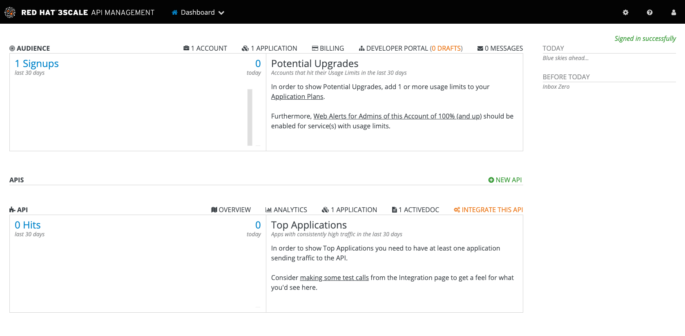
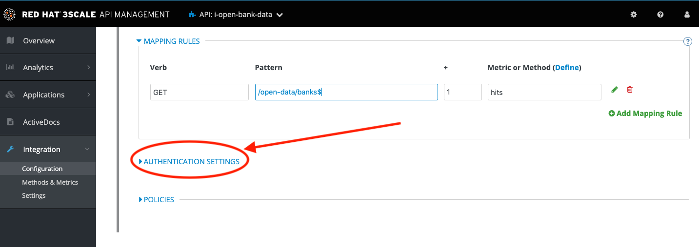
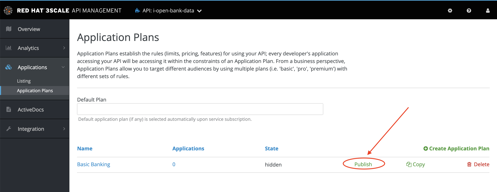
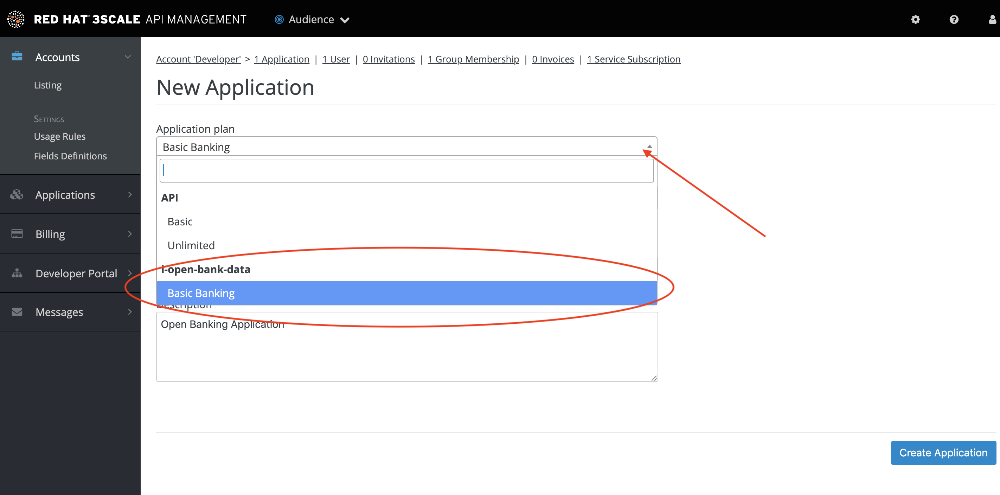

:3scale-admin-url: https://{user-username}-admin.{openshift-app-host}/p/login
:3scale-url: https://www.3scale.net/
:testing-url: https://apitester.com/
:user-password: openshift

= Lab 02 - Managing API Endpoints

In this lab you will be adding management capabilities to your API to give you control and visibility of it's usage.

*Overview*

Upgrading services to APIs allow us to share within other teams or even third party providers some of the organization services. The API Management capabilities enable us to have better control over the way consumers access the APIs.

*Why Red Hat?*

Red Hat provides one the leading API Management tools that provides API management services. The link:{3scale-url}[3scale API Management] solution enables you to quickly and easily protect and manage your APIs.

*Credentials:*

Your username is: `{user-username}` +
Your password is: `{user-password}`

[type=walkthroughResource]
.3scale Admin Console
****
* link:{3scale-admin-url}[Console, window="_blank"]
****

[time=5]
[id='import-api']
== Import from Fuse Online

. Log in to link:{3scale-admin-url}[3scale Admin, window="_blank"] web console using `{user-username}` and password: `{user-password}`.
+
The dashboard will show a summary of the trends in usage of the platform, in terms of developers signups, usage of APIs and message sent and received.
+

+
Let’s start managing and protecting the API we just created on Fuse Online.
. Click on the green button **New API**.
+
image::images/lab2-101.png[lab2-101, role="integr8ly-img-responsive"]
. Click on **Authenticate to enable this option**, login with your credentials and click on **Allow selected permissions**.
+
image::images/lab2-102.png[lab2-102, role="integr8ly-img-responsive"]
. Select **Import from OpenShift**. It will populate the __Namespace__ and __Name__ fields with the information from the service you created in the previous lab. Click **Create Service** to continue.
+
image::images/lab2-103.png[lab2-103, role="integr8ly-img-responsive"]
. You will be redirected to the Dashboard view where a success message should appear as shown.
+

NOTE: Once the service is created you will see that in the dropdown menu where you can also see **Audience**.

[time=5]
[id='configure-api']
== API Configuration

We can now proceed on changing the details of the configuration of the API and publish the update on the Developer Portal so that the consuming Developers can sign up for the open financial API.

This is where you configure the rest of the details of the mapped and protected Service. The private base URL should already be filled with the details coming from the auto-discovery feature.

. After a few seconds your API should be added to the services list. Type in `BANK` in the search field to filter the list and show our API. Then click in the **INTEGRATE THIS API** link.
+

. We have the section where we map the Backend API (or in this case Integration service) and then 2 URLs where we expose the managed API on the staging first and production gateways or infrastructure. We will be changing the Staging and Public addresses of the gateway. In this case we are not going to use separate staging or public infrastructure so it can be the same address. 
. Click on the **edit APIcast configuration** link.
+

. Replace the **Staging Public Base URL** and the **Production Public Base URL** with the following value:
+
[source,bash,subs="attributes"]
----
  https://open-bank-data-{user-username}.{openshift-app-host}:443
----
+

. We will now make sure we map a single endpoint or resource in 3scale and disallow any other endpoint (i.e. the other endpoints have not been implemented yet so we are protecting them from being exposed). Scroll down the page and click on the **MAPPING RULES** section link.
+
image::images/lab2-202.png[lab2-202, role="integr8ly-img-responsive"]
. The endpoint you want to map is `/open-data/banks$` (notice the $ at the end of the path that will allow us to make sure users cannot improperly access any other sub-resource). Click on the green pencil icon to edit the current mapping rule. 
+
image::images/lab2-203.png[lab2-203, role="integr8ly-img-responsive"]
. Type in the patter we will be allowing to process in this case is `/open-data/banks$`.
+
image::images/lab2-204.png[lab2-204, role="integr8ly-img-responsive"]
. Scroll down a little bit further and expand the **AUTHENTICATION SETTINGS**. 
+

. We see that we have already api key protection enabled, but we might want to pass this information as HTTP Header instead of HTTP parameter. Select **As HTTP Headers** under __Credentials location__ and change the **Auth user key** header name to `key`.
+
image::images/lab2-206.png[lab2-206, role="integr8ly-img-responsive"]
+
NOTE: You can also customize the error returned to the end user. 

[time=5]
[id='api-policies']
== API Policies

These are like additional plugin that you can configure to adapt the service to your own
preference.

. Scroll down the page and click on **POLICIES**.
+

. Click on **Add Policy**.
+

. Review the policies available out of the box with 3scale.
+
image::images/lab2-302.png[lab2-302, role="integr8ly-img-responsive"]
+
NOTE: Several policies are available and the list is always increasing. Two policies / functionalities are of importance: SOAP policy to map *SOAP* services and advanced rate limit functionalities with *Edge limiting* policy. 
. Click **Cancel** to return to close the API policies.
+

. Update the **API test GET request** field with the same pattern you are mapping `/open-data/banks` (notice the exclusion of the `$`).
+
image::images/lab2-303.png[lab2-303, role="integr8ly-img-responsive"]
+
Hitting the big blue button will allow you to do two things at once:
+
 - Update the service configuration on the platform
 - Test the configuration just uploaded to the gateway.
+
NOTE: The second one will fail since we are not providing any valid key, so we will get unauthorized request but the gateway will receive the updated configuration in any case. We will now fix the test request error as advised by the warning message.

[time=5]
[id='api-app-plans']
== Application Plans

Let’s switch to explaining the role of API contracts of Application Plans.

Within the red error message a link is generated **Start with creating an application plan**. Since we are creating a Service we will need to offer a way for Developers to subscribe to it and use it. Application plan are the way to do that (also known as API Contracts).

. Click on the **Start with creating an application plan** link.
+

. Click on **Create Application Plan**
+

. Fill out the **Name** and **System Name** fields on the __Create Application Plan__ form and then click the **Create Application Plan** button to submit the form.
+
image::images/lab2-402.png[lab2-402, role="integr8ly-img-responsive"]
+
NOTE: You can safely ignore for now the monetization options.
. See that there is 1 API contract (or Application Plan), but no application associated to it. The application plans are in hidden state by default. Publish this one so that it is usable
and visible on the Developer portal by clicking on the **Publish** link.
+

. Let’s open the application plan to inspect the main elements. Click on the application plan's name link.
+
image::images/lab2-404.png[lab2-404, role="integr8ly-img-responsive"]
. Check the **Monetization** settings (trial, setup, cost per month)
+
image::images/lab2-405.png[lab2-405, role="integr8ly-img-responsive"]
. Scroll down the page to check the mapped **Metrics, Methods, Limits & Pricing Rules** (in this case generic Hits) and relative monetization and rate limiting settings.
+

. Switch to the __Audience__ tab to create an Application to test the Configuration, by clicking **API:i-open-bank-data** and then **Audience** on the top dropdown menu.
+

[time=5]
[id='accounts-and-applications']
== Accounts and Applications

From this page we can see how we can, as an API Provider, approve or deny Developers’ Accounts registrations. 

. Click on the default Developer Account
+

. See the Developer user details. Click on the **Application** link in the top level navigation.
+

. See that the Developer has the default application associated, but it’s subscribed to the default _API_ Service. Add a new application by clicking in the **Create Application** link.
+

. Here we can now subscribe the application to the Application plan we created on our new Service. Select the correct **Application Plan** from the drop down field available. 
+

Fill in the rest of the fields with some basic details and click the big blue button **Create Application**.
+

. Now we have a valid **User Key** API credential so we can go back to the Configuration window of the API service and make a successful test call. Click on **Integration** and then on **Configuration** in the left side menu.
+

. Click on **edit Apicast configuration**.
+

. Scroll all the way down. See there is now a pre-populated key in the example curl statement, try again testing the deployed configuration by clicking on **Update & test in Staging Environment**.
+
image::images/lab2-507.png[lab2-507, role="integr8ly-img-responsive"]
. See we turned the testing into a success.
+

[time=5]
[id='dev-portal']
== Developer Portal

Let’s switch to the developers’ point of view by accessing the __Developer Portal__. 

. Switch to the __Audience__ tab, by clicking **API:i-open-bank-data** and then **Audience** on the top dropdown menu.
+

. Click on **Developer Portal** to expand the left menu and then click **Visit Portal**.
+

+
NOTE: The sidebar allows us to edit pages of the Developer Portal live, but we are not interested in it for now.
. Close the right sidebar menu by clicking the small **X** icon on the top right side.
+

. Click on the top right **SIGN IN** link. 
+

. Login with the default user credentials provided in the sidebar. This is the default developer user, created for the default developer account username: `john` and password: `123456`.
+

. Let’s see the Applications created. Click in the **See your Applications & their credentials** button.
+

. We are now in the developer’s application dashboard. Copy the **credentials** associated with the application.
+

[time=5]
[id='testing']
== Testing
[type=taskResource]
.Testing
****
* link:{testing-url}[API testing tool, window="_blank"]
****

Let’s move to the online to continue testing. 

. Open the link:{testing-url}[API testing tool, window="_blank"] in a new tab.
. Fill in the **URL** endpoint with the **Staging Public Base URL**  you configured in your 3scale service plus the open banking operation path we implemented. Then click on **Test**
+
[source,bash,subs="attributes"]
----
  https://open-bank-data-{user-username}.{openshift-app-host}/open-data/banks
----
+

. You got a `HTTP/1.1 403 Forbidden` error code as a result. This is because you didn't send the __Authentication parameters__ that identify the testing application.
+
image::images/lab2-701.png[lab2-701, role="integr8ly-img-responsive"]
. Scroll up the page and add the __User Key__ to the request headers by clicking on **Add Request Header**. Add the `key` header and the provided user key you copied from the Developer portal. Then, click **Test** again.
+
image::images/lab2-702.png[lab2-702, role="integr8ly-img-responsive"]
. As we can see we succeed with `HTTP/1.1 200 OK`!
+

[type=verification]
****
Is your result similar to the image?
****

[type=verificationFail]
Verify that you followed each step in the procedure above.  If you are still having issues, contact your session facilitator.