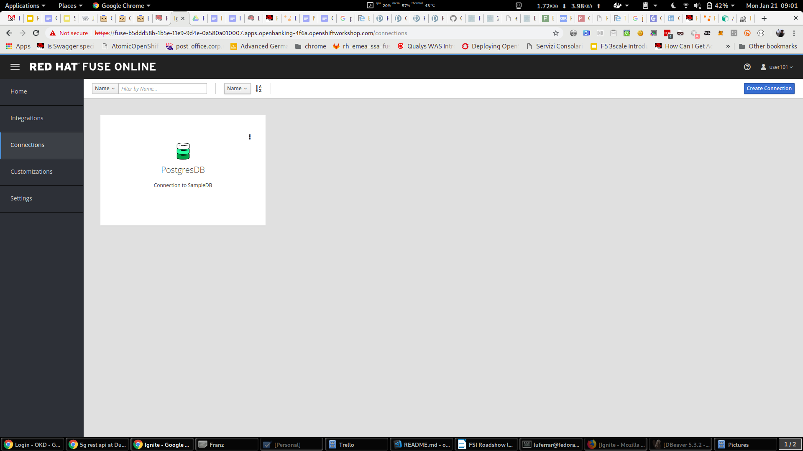
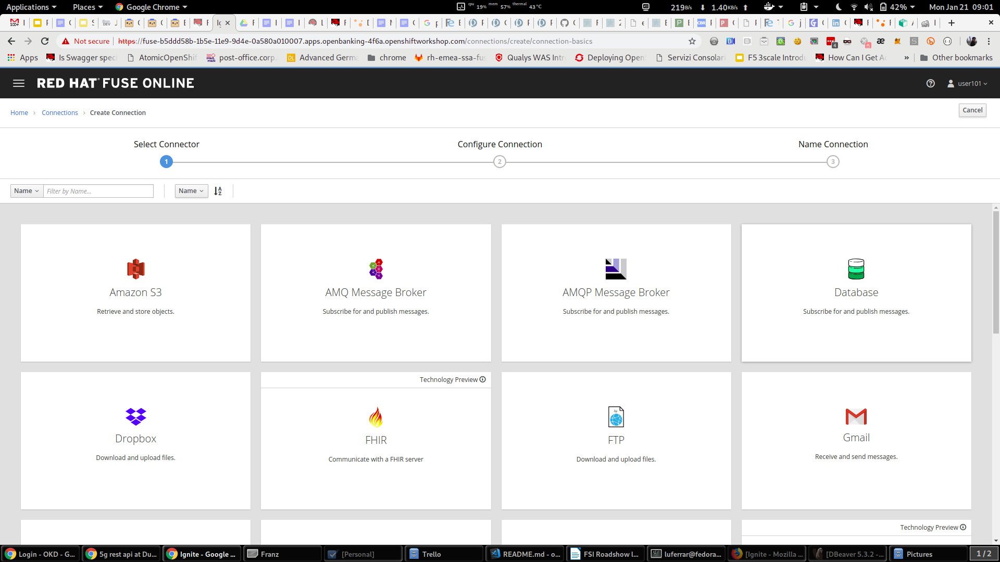
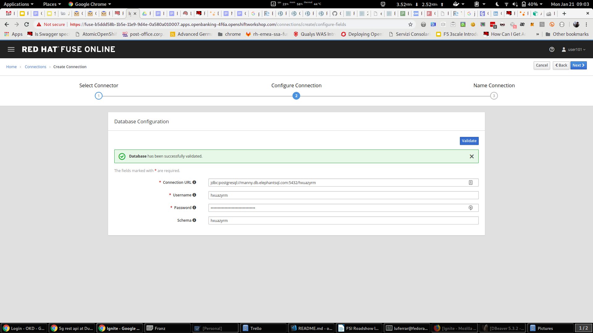
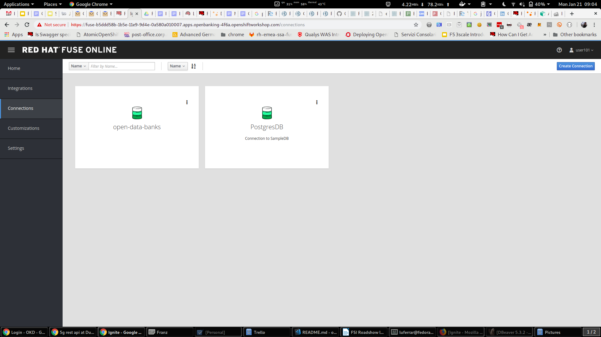

:apitester-url: https://apitester.com/

= Lab 01 - Financial Backend Services

This first session will take us to the creation of a simple REST service from a database source.

This is quite a common scenario and one that goes well for quick prototyping service scenarios.

// [type=walkthroughResource,serviceName=fuse]
// .Fuse Online
// ****
// * link:{fuse-url}[Console, window="_blank"]
// ****

// [type=walkthroughResource,serviceName=openshift]
// .Red Hat OpenShift
// ****
// ****

// [type=walkthroughResource]
// .API Tester
// ****
// * link:{apitester-url}[API Tester, window="_blank"]
// ****

[time=15]
[id='database-connection']
== Database connection

[type=taskResource,serviceName=fuse]
.Fuse Online
****
* link:{fuse-url}[Console, window="_blank"]
****

Let’s start by creating the connection to an existing DB part of our existing infrastructure. It is a data store built on PostgreSQL and (for this lab) hosted on OpenShift. You could be running this anywhere else, as long as you have a direct connection to the DB to use.

. Open a new browser tab and navigate to link:{fuse-url}[Fuse Online Console, window="_blank"]
. Go to *Connections* -> *Create connection*
+

. Select *Database* connector
+

. Use the following connection details and validate them:
+
 Connection details: jdbc:postgresql://postgresql.shared.svc:5432/sampledb
 username: dbuser
 password: password
+

. Let’s name the connection and finalize the configuration of the connector (*Create*).
+
image::images/image84.png[image4, role="integr8ly-img-responsive"]

We can now use this connection as an integration starting, middle or finishing point.

Now that we have configured the end of the integration path we want to build and we will see where to find the start and we will put the two pieces together. 

[time=10]
[id='creating-integrations']
== Creating Integrations

We will start by exposing a REST endpoint that will then get mapped to the backend datasource.

. Click on *Integrations* - *Create Integration*
+
image::images/image97.png[image6, role="integr8ly-img-responsive"]
Use the API Provider connector with the following OpenAPI file:
https://raw.githubusercontent.com/lucamaf/open-banking-roadshow/master/open-dataapis-nokey.json

The definition is the same one seen on the Open Banking solution portal for Open Data APIs.

. There is a validation happening on the API definition, but no error was identified so we can proceed with the configuration of the connector.
. To show how easy it is to correct definitions -> review/edit
. This opens a window on Apicurito which is a scaled down version of Apicurio, our API Design platform. It is fairly easy to change elements graphically and also with the help of this tool an API team can start with a Design First approach when configuring the API. Also the same team doesn’t need to know about the rules around OpenAPI specifications thanks to this tool.
. The service is exposed without any protection (that’s one of the reasons we are going to be using 3scale later on) since the API definition is not adding any authentication on top of it by default.
. Name the integration.
. And save and continue
. We are going to map just one of the endpoint exposed, in particular the get banks (/banks) one.
. Click on get list of banks

=== Add a connection

We now have a dumb pipe which connects an endpoint to receive user requests and return
always 200 (all OK) - the return blue arrow symbol. Not very useful integration but a starter!

Let’s connect this front end to the database we previously configured as a terminating
connection.

. Click on the previously configured data source.
. And we will invoke a simple SQL statement to return the data from a single table. The simple statement to introduce is:
select * from banks
When you click done the statement will validate and you should be able to proceed with the configuration of the integration.
. And now let’s add a simple log of the requests coming through. 
. Add a step.
. Select the log step.
We are going to be sending a copy of the responses coming through to the integration log.
We are going to log just the message body.
We are now ready to deploy and expose this integration in our platform, to use it. 
. Hit Publish
You can check the progress in building the integration changing through phases.
We can notice the platform is getting the required components and constructing the block.
When the building is completed we can test the Integration block.

 SINCE AUTO DISCOVERY FEATURE IS ACTIVE WE WILL NOT GET AUTOMATICALLY A URL WITH THE INTEGRATION BUILDING PROCESS, BUT API MANAGEMENT WILL BE ABLE TO SEE IT AND EXPOSE IT ANYWAYS

[time=5]
[id='testing']
=== Testing

Now that we have seen how to build the full integration you can test the integration just built, using this online tool link:{apitester-url}[API Tester, window="_blank"]. 

We will use the following URL to test it http://idb2rest-fuse-7df78d66-28d4-11e9-aad0-0a580a010007.apps.openbanking-fe8e.openshiftworkshop.com

API tester works as a full Web or Mobile application but stripped down of the GUI.

. Populate the fields with the following URL
http://i-db2rest-fuse-7df78d66-28d4-11e9-aad0-0a580a010007.apps.openbanking-fe8e.openshiftworkshop.com/open-data/banks
+
image::images/image85.png[image6, role="integr8ly-img-responsive"]
. Test
+
image::images/image38.png[image6, role="integr8ly-img-responsive"]
. Check that everything went 200 fine and open the Response Body (eye icon)
+
image::images/image22.png[image6, role="integr8ly-img-responsive"]

The response is in JSON format, with basic information given around banks (dummy data)

[type=verification]
****
Is your result similar to the image?
****

[type=verificationFail]
Verify that you followed each step in the procedure above.  If you are still having issues, contact your lab facilitator.
